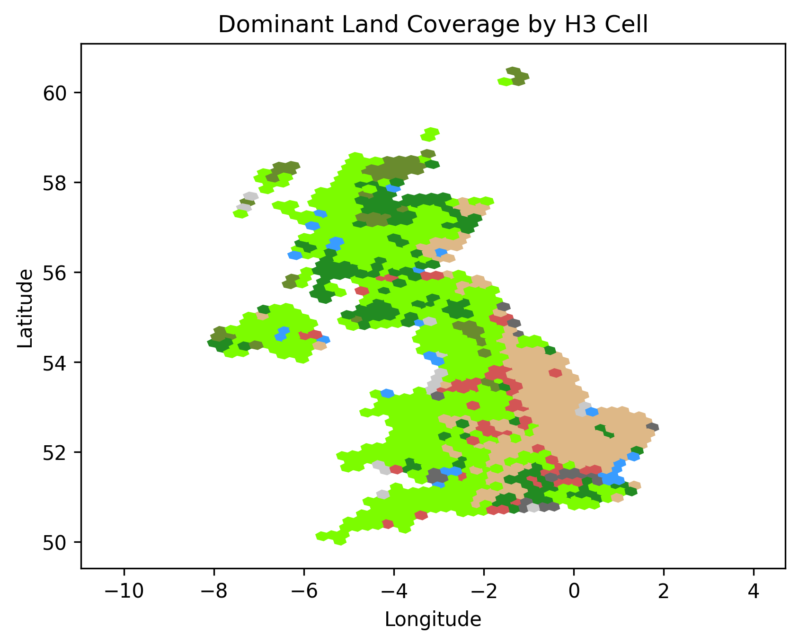

# UK Land Coverage

## Purpose

The goal of this code is to create a 10x10 km (and maybe a 5x5 km) grid of the
UK for use in the National Energy Explorer sim.  Currently the simulation uses
400 tiles covering the land and ~1/3 of the UK's EEZ sea area.  This forms about
200 (197) tiles of 35x35km.

But it would be good to be able to show a finer grain (high resolution)
approximation of the land cover of the UK.

## Data in ceh_1km_data

Downloaded from [CEH Land Cover Map 2024 (1km summary rasters, GB and N. Ireland)](https://catalogue.ceh.ac.uk/documents/0ac15fd6-6f3a-4f28-8ed7-34461ca62a6e) -> https://data-package.ceh.ac.uk/data/0ac15fd6-6f3a-4f28-8ed7-34461ca62a6e.zip (requires login).

## Dev

Install dependencies and activate the virtual environment given instructions in [README.md](../../../README.md#Dev).

## Known limitations

The [CEH data classifies solar panel farms as urban and suburban](https://ajamesphillips.com/blog/built-area-solar-power-density#possible-reasons-for-the-difference).  Using a
different classification, perhaps of TESSERA or COPERNICUS data would be
preferable.

## Processing data

Run `python aggregate_land_coverage_by_h3_cell.py` to generate the [gb_aggregated_land_coverage_h3_r5.json](gb_aggregated_land_coverage_h3_r5.json) and [ni_aggregated_land_coverage_h3_r5.json](ni_aggregated_land_coverage_h3_r5.json) files.

Run `python find_dominant_land_coverage_by_h3_cell.py` to generate the [gb_dominant_land_coverage_h3_r5.json](gb_dominant_land_coverage_h3_r5.json) and [ni_dominant_land_coverage_h3_r5.json](ni_dominant_land_coverage_h3_r5.json) files.

Run `python plot_dominant_land_coverage_h3_cells.py` to generate a plot of the dominant land coverage json files which currently looks like:

