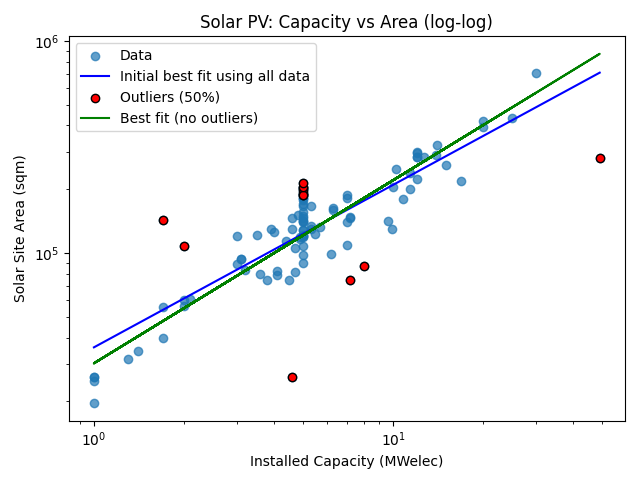
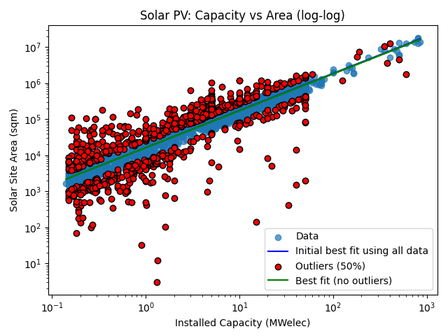

# Processing

* Download the data from: https://www.gov.uk/government/publications/renewable-energy-planning-database-quarterly-extract
* Place as a file named data/REPD_publication_Q1_2026.csv (or whatever it is called) in this directory
* Update the script in process.py to have the new file name
* Run process.py to generate the processed data file data/solar_farms_uk_Q1_2026.csv

## Solar farms

Several of the solar farms are either missing areas or have areas which are very
small or large for their installed capacity.  A sample of the first 100 entries
shows:

A line of best fit was formed by excluding outliers (shown in red).  There's
almost certainly a more robust statistical approach to this but this seems well
enough for now.

