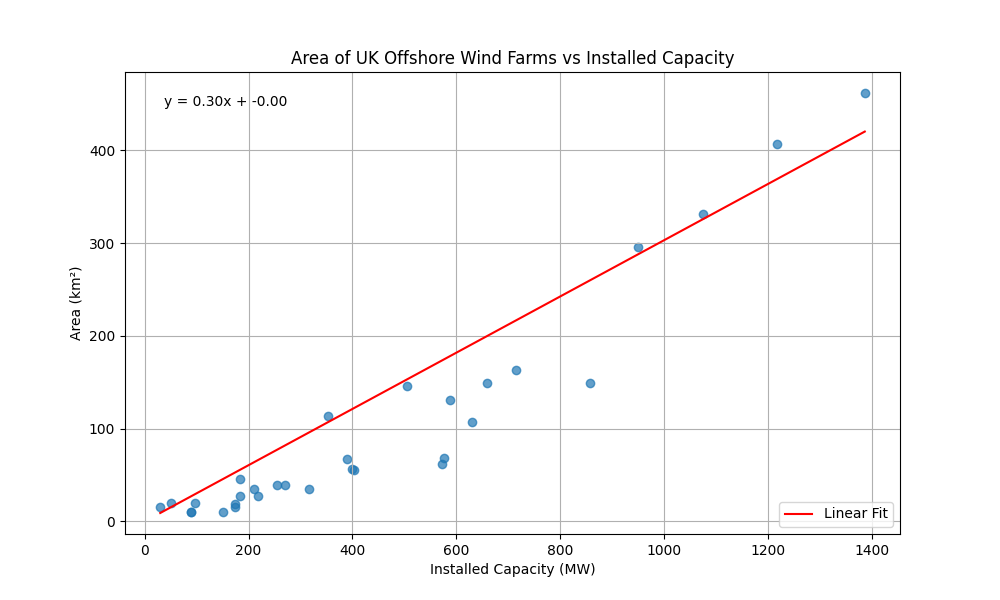
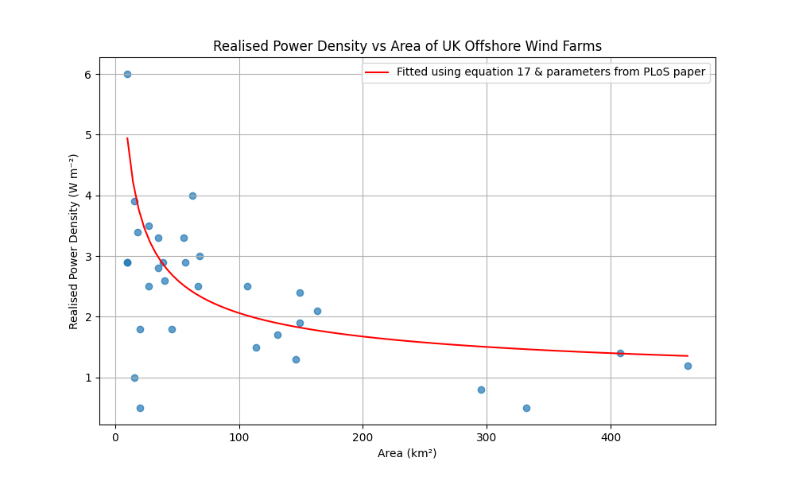

# process.py

[process.py](process.py) is used to process the data from table 1 of https://doi.org/10.1371/journal.pone.0321528
into a CSV file: [data/uk_subset_of_offshore_wind_farms.csv](data/uk_subset_of_offshore_wind_farms.csv)

## Back calculating wind farm area from installed capacity

The [Renewable Energy Planning Database](https://www.gov.uk/government/publications/renewable-energy-planning-database-quarterly-extract) used by the WikiSim page [UK wind farms by year](https://wikisim.org/wiki/1296v3) does not have the area for offshore and onshore wind farms.

The paper "[Power production and area usage of offshore wind and the relationship with available energy in the atmosphere](https://doi.org/10.1371/journal.pone.0321528)" by Nøst, Ole Anders 2025, has a table with a selection of 31 offshore wind farms in the UK.

Here the installed capacity is plotted vs area for this selection of wind farms and a linear line of best fit is added passing through the origin:

This gives a formula for area (km^2) of: installed capacity (MW) * 0.3 ≈ area (km^2)

## Realised power density of offshore wind farms

Using [equation 17](https://journals.plos.org/plosone/article?id=10.1371/journal.pone.0321528#pone.0321528.e052) with the parameters of [ZP equals 0.74 Wm⁻², and WP equals 3729 Wm⁻¹](https://journals.plos.org/plosone/article?id=10.1371/journal.pone.0321528#pone.0321528.e052#:~:text=ZP%20equal%20to%200.78%20Wm%E2%88%922%20and%200.74%20Wm%E2%88%922,%20and%20WP%20equal%20to%203414%20Wm%E2%88%921%20and%203729%20Wm%E2%88%921) from the paper by Nøst 2025 we can approximate the realised power density of offshore wind farms given the area of the wind farm.

e.g. for an area of 100 km², the circumference is given by: `2 * pi * sqrt(area / pi)` (assuming a circular wind farm) = 35.4 km = 35400 m

And the realised power density (W m⁻²) = Wp * (circumference m² / area m²) + Zp

e.g. realised power density (W m⁻²) = 3729 * (35400 / 100e6) + 0.74 = 2.06 W m⁻²

 
 
 
 

# data.ts

[data.ts](data.ts) is used to generate the files:
* [data/_2018_texas_80_Vestas_V90_2000@core@0.0.10.csv](data/_2018_texas_80_Vestas_V90_2000@core@0.0.10.csv)
* [data/_2018_texas__offshore_80_Vestas_V90_2000@core@0.0.10.csv](data/_2018_texas__offshore_80_Vestas_V90_2000@core@0.0.10.csv)
* [data/_2018_united_kingdom_80_Vestas_V90_2000@core@0.0.10.csv](data/_2018_united_kingdom_80_Vestas_V90_2000@core@0.0.10.csv)
* [data/_2018_united_kingdom__offshore_80_Vestas_V90_2000@core@0.0.10.csv](data/_2018_united_kingdom__offshore_80_Vestas_V90_2000@core@0.0.10.csv)

These are used in [EnergyExplorer v1](https://wikisim.org/wiki/1080)
